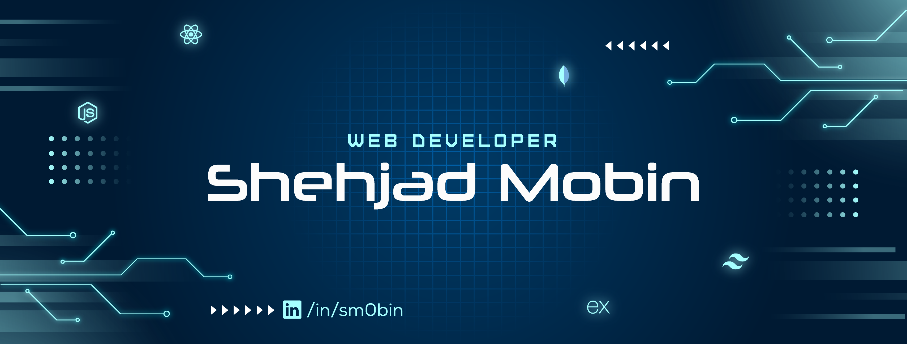

 

# **Hi there 👋**

I am **Shehjad Mobin**, a **_Full Stack Web Developer_** specialized in **_MERN Stack technologies_**. Dedicated to crafting responsive, visually appealing, and impactful web applications. Passionate about building efficient and scalable solutions that tackle real-world problems. Always ready for a challenge and eager to embrace new technologies.

 

# ☕ Find Me On

 

# 🛠️ Technologies I Use

<!--  -->

 

# ✏️ Current overview

### 🔭 I’m currently working on a Class Scheduling Web Application.

### 🌱 I’m currently learning Next.js.

 

# 📈 Current Stats

 
